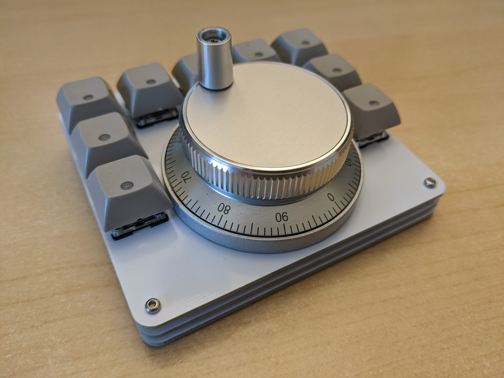

# EncoderPad RP2040

### What is the EncoderPad RP2040?

The EncoderPad RP2040 is a Video Editing Macropad with a 60mm Encoder Wheel. This encoder is made of metal and feels like it will last forever. The EncoderPad uses 9 mechanical switches (Cherry MX type).  The keys are hot-swap socketed and have an individual underglow RGB LED which can be turned on.

### How do I build it?

You don't need many tools to build it!  
* Install the rotary encoder on the top plate. (there are nuts at the back)
* Press the switches through the top plate
* Align the key switch pins with their sockets and press them in, 
* Attach the wires for the rotary encoder
* Screw in the top/bottom screws through the standoffs
* Install the keycaps
* Install the adhesive rubber bump ons as feet.

### How do I program it?

The Encoder Pad can be programmed with CircuitPython.  To get started, get the latest download from the official [CircuitPython.org](https://circuitpython.org/) site, put the RP2040 in  booloader mode by pressing "reset" while pressing the "boot" button and drag/drop in the UF2 file you just downloaded. You are now ready to program it! No build tools required on your computer!

Note: CircuitPython is licensed under the [MIT License](https://github.com/adafruit/circuitpython/blob/main/LICENSE).

### Hardware License

Design of the EncoderPad_RP2040 is licensed under **CERN Open Hardware Licence Version 2 - Weakly Reciprocal**

See license.txt for more details. See this [FAQ](https://ohwr.org/project/cernohl/wikis/faq#q-copyright-does-not-cover-hardware-how-do-you-implement-strongly-reciprocal-licensing-in-cern-ohl-s) for more information on this license.

### Licenses from reference material and libraries

|  Item  | Description | Source  | License  |
|----|----      | :-----  | :-------- |
| RP2040 Hardware Design Guide  | RP2040 Documentation (for reference) | [link](https://datasheets.raspberrypi.org/rp2040/hardware-design-with-rp2040.pdf) | CC BY-ND |
| RP2040 Minimal Design Example | Kicad Project | [link](https://datasheets.raspberrypi.org/rp2040/Minimal-KiCAD.zip) | 3-Clause BSD (considered as source code included as part of documentation) |
| kicad libraries | Core libraries from Kicad | [link](https://www.kicad.org/libraries/license/) | CC-BY-SA 4.0 (with exception)|
| kicad libraries | switch symbols and footprints | [link](https://github.com/sszczep/kicad-libraries)| MIT | 

### openmoko-usb-oui application details

[USB PID Request](https://github.com/openmoko/openmoko-usb-oui)

1. (done) Have a README[.txt|.md] file describing which part is under which license this will help to quickly identify the project's license, particularly when several licenses are combined, or your are using libraries under other licenses. Also make sure the combination is allowed by the individual licenses.
2. (done) Include all full text licenses in a LICENSE[.txt] file
3. (done) Include a copyright notice in the schematic sheet(s), including author and date this will determine who the copyright holder is, and when the copyright will expire.
4. (done) Include the license name in the schematic sheet(s) this becomes important when different license are combined, and parts of the project, or libraries, are under different licenses
5. (done) Include all schematic symbols and board footprint libraries in the project without that the project can't be seen as complete. Also ensure their license is compatible.
66. (done) Export the schematic capture as pdf, and board layout as gerber+NC drill [and other fabrication output] files - not every user can, or wants, to install the EDA suite you are using. This is even more important if in the future this suite stops supporting the current format. If you don't want to mix the fabrication output with the source files, have a general project page pointing to the source files and fabrication output.